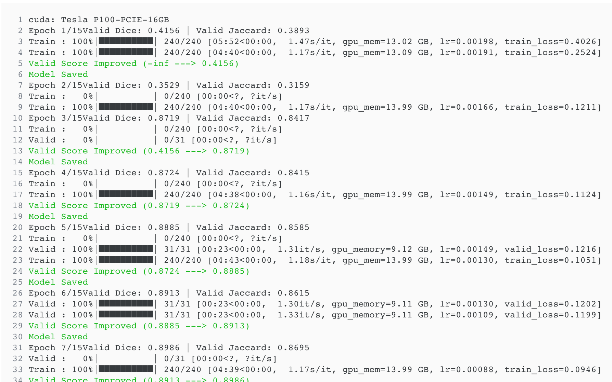

## 胃腸道影像分割 (UW-Madison GI Tract Image Segmentation) (U-Net) (Pytorch)  
Data source：happyharrycn, Maggie, Phil Culliton, Poonam Yadav, Sangjune Laurence Lee. (2022). UW-Madison GI Tract Image Segmentation . Kaggle. https://kaggle.com/competitions/uw-madison-gi-tract-image-segmentation  
    
- **Core**: GPU P100    
  
### 專案目的  
  
**此專案目的在於辨識出腹部MRI(核磁共振)影像中，腸胃道(大腸、小腸、胃)的位置**。  
我們需要將**不規則的區域**辨識並標示出來，為達到此目的，我們需要用到**影像分割模型**。  
這裡使用廣泛用於醫療上的**U-Net模型**做影像分割及標注。  
  
### 背景描述
<details open>
<summary>點擊展開說明</summary><br>

2019年，全球估計有500萬人被診斷出患有胃腸道癌症。在這些患者中，大約一半有資格接受放射治療，通常每天進行 10-15 分鐘，持續 1-6 週。放射腫瘤科醫師嘗試使用 X 射線束針對腫瘤提供高劑量的放射，同時避開胃和腸道。借助整合磁振造影和直線加速器系統（也稱為 MR-Linacs）等新技術，腫瘤學家能夠可視化腫瘤和腸道的日常位置，這些位置每天都在變化。在這些掃描中，放射腫瘤科醫師必須手動勾勒出胃和腸的位置，以便調整 X 射線束的方向，以增加向腫瘤傳遞的劑量並避開胃和腸。這是一個耗時且費力的過程，可能會將治療時間從每天 15 分鐘延長到每天 1 小時，這對於患者來說可能難以忍受，除非深度學習可以幫助自動化分割過程。分割胃和腸的方法將使治療更快，並使更多的患者獲得更有效的治療。  
  
</details><br>

### 資料內容    
    
**MRI掃描資料**來自實際的癌症患者，他們在放射治療期間的不同日期進行了 1-5 次 MRI 掃描。  
訓練註解以 **RLE 編碼遮罩**形式提供，影像採用 **16 位元灰階** PNG 格式。  
大約有 **50 個案例**，天數和切片數各不相同。每個案例都由多組掃描切片代表（每組由掃描發生的日期標識）。   
有些案例按時間劃分，而有些案例則按案例劃分 - 資料**未區分訓練或測試資料**。  
    
影像檔案名稱包含 4 個數字（例如276_276_1.63_1.63.png）。  
這四個數字是切片寬度/高度（以像素為單位的整數）和寬度/高度像素間距（以毫米為單位的浮點數）。  
前兩個定義投影片的解析度。最後兩項記錄每個像素的物理尺寸。  
  
資料總共包含**38496個樣本**，分別**標註為大腸、小腸、胃**。  
  
### 專案使用資源    
  
- **wandb**：幫助紀錄訓練資料並加以統計。    
- **scikit-learn**：使用內部所提供的StratifiedKFold等資料庫，有助於折疊整理資料。    
- **albumentations**：協助產生資料擴增功能。  
- **segmentation_models_pytorch**：使用其所提供的U-Net模型。  
- **RLE**：使用RLE進行資料壓縮，包含編碼及解碼功能。  
  
### 執行步驟說明  
  
- **資料處理**  
    
  **建立Database**，我們使用Wandb作為訓練**資料儲存及統計**工具，需要**API**才可使用。  
  ```
  Wandb (Weights & Biases)
  Weights & Biases (W&B) is MLOps platform for tracking our experiemnts. We can use it to Build better models faster with experiment tracking, dataset versioning, and model management. Some of the cool features of W&B:
  
  Track, compare, and visualize ML experiments
  Get live metrics, terminal logs, and system stats streamed to the centralized dashboard.
  Explain how your model works, show graphs of how model versions improved, discuss bugs, and demonstrate progress towards milestones.
  ```
    
  建立**設定參數**及設定**亂數種子**。    
  讀取統計資料並**建立所需的資料表**，並**區分空值及非空值**的資料。  
      
  建立**遮罩產生函數**(使用RLE解碼成遮罩)及**影像顯示函數**。  
  **折疊資料**，將區分的資料折疊為五個資料夾  
  ```
  fold  empty
  0.0   False    3257
        True     4551
  1.0   False    3540
        True     4540
  2.0   False    3053
        True     3923
  3.0   False    3407
        True     4801
  4.0   False    3333
        True     4091
  Name: id, dtype: int64
  ```
    
- **建立Dataset**  
    
  依照上述所建立的資料表及遮罩功能讀取資料，建立資料列表，  
  並回傳**圖片張量、遮罩張量**。
    
  若傳入資料擴增函數則進行**資料擴增**後回傳資料。
    
- **建立資料處理及擴增**  
    
  功能包含**改變大小、隨機水平翻轉、隨機旋轉、隨機變形及隨機加入噪點**。  
    
- **建立Dataloader**  
    
  依照折疊索引**建立訓練及驗證Dataloader**，使兩者**不重複**。  
  這裡使用**Fold 0作為驗證資料**，**Fold 1～4皆為訓練資料**。  
  訓練資料中**皆使用資料擴增**功能。  
    
  **查看訓練資料影像**：  
    
      
      
- **建立模型**    
    
  使用smp中所提供的**Unet模型**，   
  設定**編碼器為efficientnet-b1**，  
  使用imagenet**預訓練權重**初始化編碼器，  
  輸入通道為**RGB**，**3個通道**，  
  輸出為**3個class(大腸,小腸,胃)**，  
  模型最終**輸出不使用激活函數**(Sigmoid or Softmax)。
  ```
  ================================================================================
  Layer (type:depth-idx)                                  Param #
  ================================================================================
  ├─EfficientNetEncoder: 1-1                              --
  |    └─Conv2dStaticSamePadding: 2-1                     --
  |    |    └─ZeroPad2d: 3-1                              --
  |    └─BatchNorm2d: 2-2                                 64
  |    └─ModuleList: 2-3                                  --
  |    |    └─MBConvBlock: 3-2                            1,448
  |    |    └─MBConvBlock: 3-3                            612
  |    |    └─MBConvBlock: 3-4                            6,004
  |    |    └─MBConvBlock: 3-5                            10,710
  |    |    └─MBConvBlock: 3-6                            10,710
  |    |    └─MBConvBlock: 3-7                            15,350
  |    |    └─MBConvBlock: 3-8                            31,290
  |    |    └─MBConvBlock: 3-9                            31,290
  |    |    └─MBConvBlock: 3-10                           37,130
  |    |    └─MBConvBlock: 3-11                           102,900
  |    |    └─MBConvBlock: 3-12                           102,900
  |    |    └─MBConvBlock: 3-13                           102,900
  |    |    └─MBConvBlock: 3-14                           126,004
  |    |    └─MBConvBlock: 3-15                           208,572
  |    |    └─MBConvBlock: 3-16                           208,572
  |    |    └─MBConvBlock: 3-17                           208,572
  |    |    └─MBConvBlock: 3-18                           262,492
  |    |    └─MBConvBlock: 3-19                           587,952
  |    |    └─MBConvBlock: 3-20                           587,952
  |    |    └─MBConvBlock: 3-21                           587,952
  |    |    └─MBConvBlock: 3-22                           587,952
  |    |    └─MBConvBlock: 3-23                           717,232
  |    |    └─MBConvBlock: 3-24                           1,563,600
  |    └─Conv2dStaticSamePadding: 2-4                     --
  |    |    └─Identity: 3-25                              --
  |    └─BatchNorm2d: 2-5                                 2,560
  |    └─AdaptiveAvgPool2d: 2-6                           --
  |    └─Dropout: 2-7                                     --
  |    └─MemoryEfficientSwish: 2-8                        --
  ├─UnetDecoder: 1-2                                      --
  |    └─Identity: 2-9                                    --
  |    └─ModuleList: 2-10                                 --
  |    |    └─DecoderBlock: 3-26                          1,586,176
  |    |    └─DecoderBlock: 3-27                          488,960
  |    |    └─DecoderBlock: 3-28                          124,672
  |    |    └─DecoderBlock: 3-29                          36,992
  |    |    └─DecoderBlock: 3-30                          6,976
  ├─SegmentationHead: 1-3                                 --
  |    └─Conv2d: 2-11                                     435
  |    └─Identity: 2-12                                   --
  |    └─Activation: 2-13                                 --
  |    |    └─Identity: 3-31                              --
  ================================================================================
  Total params: 8,346,931
  Trainable params: 8,346,931
  Non-trainable params: 0
  ================================================================================
  ```
    
- **建立損失函數**  
      
  這裡的損失函數使用**兩種不同的損失函數加權組成**，  
  一為**BCELoss**(**二元交叉熵損失函數** Binary Cross Entropy Loss)，    
  此函數用於衡量模型預測的**概率分布與真實標籤之間的差異**。  
  另一個為**TverskyLoss**，是基於Tversky指數的損失函數，用於**處理類別不平衡問題**。  
      
  此處將**權重配為1:1**，此設計有助於：  
  - **兼顧精確度和召回率**。  
  - **處理類別不平衡的問題**。  
  - **提升影像分割模型在不同情況下的泛化能力**。  
    
- **建立優化器**    
      
  建立**Adam優化器**，並建立一個**scheduler自動調整**優化器中的**學習率**。  
  scheduler選用**CosineAnnealingLR**，此功能為，在訓練過程中，學習率會按**照餘弦函數的曲線進行調整**。  
      
- **模型訓練**  
    
  此訓練使用**混合精度**(float16)做計算，**提高計算速度及降低記憶體消耗**。  
  使用tqdm顯示訓練進度集執行資訊。    
      
  **訓練步驟**：  
  1. 讀取一筆資料，包含**圖片張量**及**遮罩標籤張量**。  
  2. 啟用**混合精度訓練**。  
  3. 將圖片**輸入模型**中，並取得預測結果。  
  4. 將模型預測結果與遮罩標籤輸入損失函數**計算損失**。  
  5. 將損失做**反向傳播**，並計讓透過scheduler計算梯度**更新權重**。  
  6. **統計損失及正確率**，並作紀錄。  
 
- **模型驗證**  
    
  此處不需要做混合精度計算，**直接提取資料輸入模型中**，取得輸出資料並計算損失。  
    
  將結果輸入**Sigmoid計算**，此處容易誤解，看似需要取得三類的結果，  
  但實際是要取得是否為腸胃區域，所以是做**二分法計算**。  
    
  將預測計算後結果與遮罩標籤**做Dice計算**，得出**正確面積的比例**。  
  **計算Jaccard相似度係數**(Intersection over Union，IoU)，計算標籤重疊程度。  
  紀錄統計資料。  
    
- **執行訓練程式**  
    
  每次迭代中執行**訓練模型**及**驗證模型**程序，  
  並記錄訓練資料，包還**Loss、Dice、Jaccard、和LR(學習率)**。  
    
  記錄並**儲存每次的模型權重**，**追蹤表現最佳的迭代**並儲存最佳模型權重，  
  以**Dice指標衡量**模型的表現。  
    
  在每次迭代中，**皆使用最佳表現的模型參數進行迭代**，  
  若此次訓練結果**未能超越**，則**捨棄此迭代**之訓練權重。  
    
- **訓練結果**  
    
  **迭代15次**做訓練，結果如下：  
  ```
  Epoch 1/15
  Train : 100%|██████████| 240/240 [05:52<00:00,  1.47s/it, gpu_mem=13.02 GB, lr=0.00198, train_loss=0.4026]
  Valid : 100%|██████████| 31/31 [00:50<00:00,  1.64s/it, gpu_memory=9.09 GB, lr=0.00198, valid_loss=0.4076]
  Valid Dice: 0.4156 | Valid Jaccard: 0.3893
  Valid Score Improved (-inf ---> 0.4156)
  Model Saved
  
  Epoch 2/15
  Train : 100%|██████████| 240/240 [04:40<00:00,  1.17s/it, gpu_mem=13.09 GB, lr=0.00191, train_loss=0.2524]
  Valid : 100%|██████████| 31/31 [00:23<00:00,  1.30it/s, gpu_memory=9.10 GB, lr=0.00191, valid_loss=0.3356]
  Valid Dice: 0.3529 | Valid Jaccard: 0.3159
  
  Epoch 3/15
  Train : 100%|██████████| 240/240 [04:41<00:00,  1.17s/it, gpu_mem=13.98 GB, lr=0.00181, train_loss=0.1549]
  Valid : 100%|██████████| 31/31 [00:23<00:00,  1.31it/s, gpu_memory=9.17 GB, lr=0.00181, valid_loss=0.1405]
  Valid Dice: 0.8719 | Valid Jaccard: 0.8417
  Valid Score Improved (0.4156 ---> 0.8719)
  Model Saved

  ...
  
  Epoch 14/15
  Train : 100%|██████████| 240/240 [04:39<00:00,  1.17s/it, gpu_mem=13.99 GB, lr=0.00002, train_loss=0.0793]
  Valid : 100%|██████████| 31/31 [00:23<00:00,  1.30it/s, gpu_memory=9.12 GB, lr=0.00002, valid_loss=0.1100]
  Valid Dice: 0.9052 | Valid Jaccard: 0.8771
  
  Epoch 15/15
  Train : 100%|██████████| 240/240 [04:41<00:00,  1.17s/it, gpu_mem=13.99 GB, lr=0.00000, train_loss=0.0787]
  Valid : 100%|██████████| 31/31 [00:23<00:00,  1.30it/s, gpu_memory=9.12 GB, lr=0.00000, valid_loss=0.1098]
  Valid Dice: 0.9056 | Valid Jaccard: 0.8774
  Valid Score Improved (0.9054 ---> 0.9056)
  Model Saved

  Training complete in 1h 18m 7s
  Best Score: 0.8774
  ```
    
  這裡的Best Score為最佳的**jaccard指標**，分數為**0.8774**，  
  意指預測結果**與正確結果重疊度為87.74%**  
    
    
  這裡還顯示了訓練的**統計數值**，可以看出**訓練趨勢**：  
    
    
  以下為**Wandb統計結果**顯示：  
    
  可以看到**訓練及驗證損失皆持續下降**，**未產生過度配適**情況。  
  可以看到在**損失下降同時學習率也跟著下降**，以訓練情況做調整。  
    
    
  此表統計**系統資源消耗**情況  
    
    
    
  也同時紀錄**系統Log**  
      
      
    
- **模型測試**  
    
  在**驗證資料**集中**取出非空值資料**。  
  載入**最佳模型參數**，將圖片輸入**模型進行預測**。  
  將結果以**Sigmoid處理**並篩選出**大於0.5的值**，生成**遮罩圖**。  
      
  顯示**胃腸道影像分割結果**，**紅色為大腸、綠色為小腸、藍色為胃部**：  
      
    


- **總結**  
    
  此模型訓練的迭代次數已經算是最佳，因為驗證損失及準確率街趨於平緩，  
  若想再進一步精進模型的表現，或許需要更多的訓練資料，或嘗試增加模型規模。  
      
  腸胃道影像未經訓練的人難以辨識出，我們只能以數據來辨識正確區域。  
  使用AI模型分割腸胃道影像的表現良好，此技術可以幫助醫療人員指出腸胃道的位置，提升更好的醫療品質。  
    
  

  
