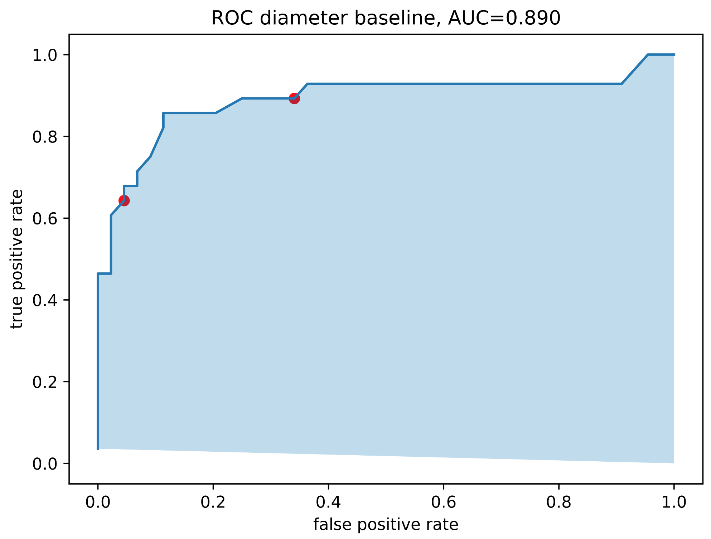

## 肺結節分析專案 (Lung Nodule Analysis)  
Reference：Deep Learning with PyTorch, Eli Stevens, Luca Antiga, and Thomas Viehmann  
Data Source：https://luna16.grand-challenge.org/  
此專案是參照Deep Learning with PyTorch之LUNA分析專案，將此專案實做於Kaggle平台上，並做模型訓練及分析。

#### 專案內容
此專案主要目的是要從CT掃描圖片中，辨識出肺結節並加以分析是否為惡性結節。  

本專案將作業切分為四個部分，分別為：  
- **[肺結節分類](./README.md)**	-         建立可處理3D-CT影像之CNN模型，並載入結節資料加以訓練。  
- **[結節影像切割](./README.md)** -  建立Unet影像分割模型，將資料處理為2D批次圖像作為輸入資料格式，並載入結節資料訓練模型。  
- **[惡性結節分類](./malignancy-predict-of-luna-pytorch.ipynb)** -       使用結節分類模型並作遷移訓練，載入惡性結節資料並做訓練。  
- **[整合模型並分析](./README.md)** -       整合上述3個模型，建立CT掃描程序，並加以分析。  

#### LUNA Grand Challenge 簡介

<details>
<summary>點擊展開說明</summary>
  
肺癌是全球癌症相關死亡的主要原因。美國的國家肺癌篩查試驗（NLST）顯示，對於高風險人群，使用年度低劑量電腦斷層掃描（CT）進行肺癌篩查比使用年度胸部X光篩查能降低20%的肺癌死亡率。2013年，美國預防服務工作組（USPSTF）對高風險人群的低劑量CT篩查給予B級推薦，2015年初，美國醫療保險和醫療補助服務中心（CMS）批准了對醫療保險受益者的CT肺癌篩查。隨著這些發展，使用低劑量CT的肺癌篩查計劃正在美國和其他國家實施。當篩查大規模實施時，計算機輔助檢測（CAD）對肺結節的檢測可能發揮重要作用。  
  
大型評估研究對不同先進CAD(Computer-aided detection)系統的性能進行調查較少。因此，我們使用大型公開的LIDC-IDRI數據集組織了一個新穎的CAD檢測挑戰。挑戰的詳細描述現在已在本文中提供。我們認為這個挑戰對於可靠地比較CAD算法以及鼓勵使用先進計算機視覺技術開發新算法具有重要意義。  

</details>

## 程式說明1 - 肺結節分類

- Core: GPU T4 x2
    
程式項目內容：
<details>
<summary>程式項目內容說明</summary>

- **公用程式**
  - Install Libraries - 安裝必要套件
  - Utils - 格式轉換、Log、訓練輔助程式
  - Disk - 快取存取程式
  - Visialize - 圖片顯示程式

- **資料集**
  - Datasets - 建立資料集程式
  - Nodule Sample - 範例顯示

- **模型**
  - Model - 建立模型程式

- **訓練程式**
  - Training - 建立訓練程式
  - Prepare Catch - 資料載入快取程式

- **訓練結果**
  - Start Training - 開始訓練及訓練結果

</details>

執行步驟說明：  
- 資料來源說明
    
  此專案資料來源為斷層掃描**3D圖像檔**(.mhd)，每個檔案大小400～500MB。此專案擷取0~5subset，一共534個檔案。  
  若載入記憶體需要240GB以上之記憶體，因為Kaggle的GPU上提供15G快取記憶體，所以此專案將檔案快取存入硬碟空間以減少記憶體之消耗，
  又因平台上只提供19.5G之儲存空間，故此專案在此需減少訓練樣本數，此模型抽取之樣本總數為**30000筆**資料。
  *(這裡我們使用SimpleITK讀取.mhd檔案)
    
  資料來源提供資料訊息一共包含： 序號, 結節中心座標(xyz), 是否為結節, 直徑, 是否為惡性。
    
- 資料處理
    
  此模型為結節的判斷，所以將資料中有關結節之資訊擷取出，包含結節及非結節資料。  
  因為我們資料來源為一個3D圖檔，我們需要知道結節位置，所以須將座標(xyz)轉換為位置(IRC)(Index,Raw,Col)資訊。  
  這裡不將整個CT作為Input，而是將結節從資料來源中切下為一個切塊(chunk)，以此作為訓練之輸入。  
  處理完後的資料包含樣本**切塊、中心座標、體素大小**、方向矩陣等。  
  在此我們將每個結節資料包裝為一個**Ct**(class)  
    
- 建立Dataset
    
  建立一個Pytorch Dataset以供訓練使用，在此將資料區分為訓練及驗證資料，以**10：1**之比例做分配。  
  這裡有發現一個問題，就是非結節資料遠比是結節資料多，以此訓練會發現模型會將結節都判定為非結節。  
  故此這裡做資料平衡處理，就是將結節及非結節資料分開，以**1:1交錯輸入**訓練。  
  在此又會發生結節資料重複輸入狀況，所以我們做一個將輸入資料做**隨機處理**(翻轉,縮放,隨機排列等)，避免過度適配情形發生。  
  整理後資料**輸出為結節張量、是否為結節標籤、序號、中心位置張量**  
    
- 建立模型
    
  此程式使用CNN模型，輸入為**3D資料**，輸出為二元標籤及機率。  
  此模型架構分為**尾部(tail)、主體(body)、頭部(head)**。  
  尾部的部分為輸入資料，做一個批次正規劃。  
  主體的部分由**4個卷積區塊**組成，每個卷積區塊由2個卷積層一個池化層組成。  
  頭部的部分，先將資料扁平化，再輸入**全連接層**，  
  **最終輸出兩個資料：二元原始資料、Softmax計算出之機率**
  此模型初始化時，使用**Kaiming 初始化**，初始化各神經網路權重
  ```
  ----------------------------------------------------------------
          Layer (type)               Output Shape         Param #
  ================================================================
         BatchNorm3d-1        [-1, 1, 32, 48, 48]               2
              Conv3d-2        [-1, 8, 32, 48, 48]             224
                ReLU-3        [-1, 8, 32, 48, 48]               0
              Conv3d-4        [-1, 8, 32, 48, 48]           1,736
                ReLU-5        [-1, 8, 32, 48, 48]               0
           MaxPool3d-6        [-1, 8, 16, 24, 24]               0
           LunaBlock-7        [-1, 8, 16, 24, 24]               0
              Conv3d-8       [-1, 16, 16, 24, 24]           3,472
                ReLU-9       [-1, 16, 16, 24, 24]               0
             Conv3d-10       [-1, 16, 16, 24, 24]           6,928
               ReLU-11       [-1, 16, 16, 24, 24]               0
          MaxPool3d-12        [-1, 16, 8, 12, 12]               0
          LunaBlock-13        [-1, 16, 8, 12, 12]               0
             Conv3d-14        [-1, 32, 8, 12, 12]          13,856
               ReLU-15        [-1, 32, 8, 12, 12]               0
             Conv3d-16        [-1, 32, 8, 12, 12]          27,680
               ReLU-17        [-1, 32, 8, 12, 12]               0
          MaxPool3d-18          [-1, 32, 4, 6, 6]               0
          LunaBlock-19          [-1, 32, 4, 6, 6]               0
             Conv3d-20          [-1, 64, 4, 6, 6]          55,360
               ReLU-21          [-1, 64, 4, 6, 6]               0
             Conv3d-22          [-1, 64, 4, 6, 6]         110,656
               ReLU-23          [-1, 64, 4, 6, 6]               0
          MaxPool3d-24          [-1, 64, 2, 3, 3]               0
          LunaBlock-25          [-1, 64, 2, 3, 3]               0
             Linear-26                    [-1, 2]           2,306
            Softmax-27                    [-1, 2]               0
  ================================================================
  Total params: 222,220
  Trainable params: 222,220
  Non-trainable params: 0
  ----------------------------------------------------------------
  Input size (MB): 0.28
  Forward/backward pass size (MB): 25.96
  Params size (MB): 0.85
  Estimated Total Size (MB): 27.09
  ----------------------------------------------------------------
  ```  
- 訓練模型  
    
  此訓練**批次大小為32**，一次訓練輸入32筆資料，並做資料平衡及強化資料多變性。  
  建立**初始化模型**(LunaModel)及**優化器(GCD)**，並將Model放置(平行)於GPU*2上。  
  建立**DataLoader**，包含訓練資料(train_dl)及驗證資料(val_dl)。  
  建立損失函數，這裡使用**交叉熵損失函數**，並使其返回每個樣本的損失值，  
  將模型輸出之logits及資料Label輸入**計算損失**，並回傳損失。  
  將損失進行**反向傳播**，再使用優化器計算梯度**更新模型參數**(weights,bias)。  
  訓練設定為每5次訓練進行一次驗證。  
  反覆迭代周期，完成模型訓練。  
    
  訓練使用**Tensorboard**來記錄訓練資訊，訓練資訊內容如下：  
  **損失**：loss/all, loss/neg, loss/pos  
  **準確率**：correct/all, correct/neg, correct/pos  
  **預測**：pr/precision(準確率), pr/recall(招回率)  
  **F1 score**: pr/f1_score, 公式為 2*(precision*recall)/(precision+recall)  
  F1分數介於0～1之間，越大表示分類模型表現越好。  
  這裡我們需要準確率及招回率皆上升才判定為良好模型。  
    
  建立一個評估函數，使其可再輸入資料中評估及紀錄執行時間(enumerateWithEstimate)。  
  在訓練之前預先將快取訓練資料存入硬碟空間中，以加速訓練速度，並減少記憶體使用率。  
    
- 訓練結果  

  此訓練使用平衡資料及資料擴增函數，並迭代10次做模型訓練。結果如下：
  ```
  E1 trn      0.2103 loss,  91.1% correct, 0.9284 precision, 0.8901 recall, 0.9089 f1 score
  E1 trn_neg  0.1939 loss,  93.1% correct (93139 of 100000)
  E1 trn_pos  0.2267 loss,  89.0% correct (89010 of 100000)
  ...
  E1 val      0.0748 loss,  97.5% correct, 0.5260 precision, 0.9643 recall, 0.6807 f1 score
  E1 val_neg  0.0744 loss,  97.5% correct (2844 of 2917)
  E1 val_pos  0.0893 loss,  96.4% correct (81 of 84)
  ...
  E10 trn      0.0467 loss,  98.5% correct, 0.9845 precision, 0.9850 recall, 0.9848 f1 score
  E10 trn_neg  0.0528 loss,  98.5% correct (98454 of 100000)
  E10 trn_pos  0.0406 loss,  98.5% correct (98502 of 100000)
  ...
  E10 val      0.0595 loss,  97.8% correct, 0.5646 precision, 0.9881 recall, 0.7186 f1 score
  E10 val_neg  0.0594 loss,  97.8% correct (2853 of 2917)
  E10 val_pos  0.0617 loss,  98.8% correct (83 of 84)
  ```
  可以看到訓練後的模型表現不錯，在陽性及陰性的正確率都有97%以上。  
  Tensorboard訓練頻估指標：  
    
  可以看出此訓練的損失有不斷下降的趨勢，但驗證的損失接近持平甚是有突然升高情形，  
  研判此模型有些許的過渡適配，若繼續訓練會有反效果。  
    
  在預測的部份我們可以看到，此模型的準確率大概6~7成左右。  
    
  若要加強模型的表現，可以做以下修正：  
  1.增加訓練樣本數，使用更多樣化的樣本作訓練減少過度適配，提高準確率。  
  2.修改模型，增加模型參數，及使用Dropout，都可以讓模型減少過度適配現象。  
  3.修改資料擴增函數，讓本為少數的陽性樣本，在重複訓練時有更多的變化。  
  

## 程式說明2 - 結節影像切割

- Core: GPU T4 x2

程式項目內容：
<details>
<summary>程式項目內容說明</summary>

- **公用程式**
  - Install Libraries - 安裝必要套件
  - Utils - 格式轉換、Log、訓練輔助程式
  - Disk - 快取存取程式
  - Visialize - 圖片顯示程式

- **資料集**
  - Datasets - 建立資料集程式

- **模型**
  - Model - 建立模型程式

- **訓練程式**
  - Training - 建立訓練程式
  - Prepare Catch - 資料載入快取程式

- **訓練結果**
  - Start Training - 開始訓練及訓練結果

</details>

執行步驟說明：  
- 資料來源說明
    
  資料來源和程式1相同，需要用到結節資料，不同的是這次在影像上需要做更多的處理。
    
- 資料處理

  此模型為分割結節影像，所以我們需要取得所有結節資料，以此作為分割模型的訓練樣本。
  這裡不將3D資料直接輸入模型處理，因為這方式所需的記憶體太過龐大，沒有這樣的資源，
  故此將資料改為2D切片作為資料的輸入，可以大大減少記憶體消耗，此方法也有缺點，就是遺失了切片及切片空間的關係。
  模型可以輸入任意影像大小進行分割，在此我們不將整張CT圖輸入做訓練，
  只針對結節的部分，產生96*96*結節厚度大小的圖片集。
  在此需要產生結節遮罩，這裡使用已中心座標往外尋找至低密度(-700)的位置作為結節區塊的判定。
  處理完後的資料包含樣本**切塊圖檔、結節遮罩切塊、中心位置**, 結節的Index等。  
  在此我們將每個結節資料包裝為一個**Ct**(class) 
  
- 建立Dataset  

  建立兩個Dataset，一個為所有資料的資料集(包含所有資料)，一個為訓練用資料集(繼承所有資料集，但只回傳為結節的資料)。
  將資料區分為訓練及驗證資料，以**10：1**之比例做分配。
  切片數量的部分這裡取結節中心前後3張，共7張切片。 
  此處的訓練樣本將96*96大小的圖檔隨機取出64*64大小，作為資料擴增的方式之一。  
  整理後資料**輸出為結節張量、遮罩張量、序號、切片中心索引**  

- 建立模型
    
  我們需要做結節影像的分割，在此使用U-Net模型分割影像資料，輸入資料為批次2D圖檔，
  輸出為經過標注的完整影像，有了這些預測的結節影像，以便給後續分類模型進行處理。
  這裡的U-Net我們做一些變化，將其包裝分為三層：
  第一層處理輸入資料，將其批次標準化。
  第二層為U-Net主體，將圖片做處理。
  第三層將輸出結果壓縮到 0 到 1 的範圍。
  此模型初始化時，使用**Kaiming 初始化**，初始化各神經網路權重。
  ```
  ----------------------------------------------------------------
          Layer (type)               Output Shape         Param #
  ================================================================
         BatchNorm2d-1            [-1, 7, 64, 64]              14
              Conv2d-2           [-1, 16, 64, 64]           1,024
                ReLU-3           [-1, 16, 64, 64]               0
         BatchNorm2d-4           [-1, 16, 64, 64]              32
              Conv2d-5           [-1, 16, 64, 64]           2,320
                ReLU-6           [-1, 16, 64, 64]               0
         BatchNorm2d-7           [-1, 16, 64, 64]              32
       UNetConvBlock-8           [-1, 16, 64, 64]               0
              Conv2d-9           [-1, 32, 32, 32]           4,640
               ReLU-10           [-1, 32, 32, 32]               0
        BatchNorm2d-11           [-1, 32, 32, 32]              64
             Conv2d-12           [-1, 32, 32, 32]           9,248
               ReLU-13           [-1, 32, 32, 32]               0
        BatchNorm2d-14           [-1, 32, 32, 32]              64
      UNetConvBlock-15           [-1, 32, 32, 32]               0
             Conv2d-16           [-1, 64, 16, 16]          18,496
               ReLU-17           [-1, 64, 16, 16]               0
        BatchNorm2d-18           [-1, 64, 16, 16]             128
             Conv2d-19           [-1, 64, 16, 16]          36,928
               ReLU-20           [-1, 64, 16, 16]               0
        BatchNorm2d-21           [-1, 64, 16, 16]             128
      UNetConvBlock-22           [-1, 64, 16, 16]               0
    ConvTranspose2d-23           [-1, 32, 32, 32]           8,224
             Conv2d-24           [-1, 32, 32, 32]          18,464
               ReLU-25           [-1, 32, 32, 32]               0
        BatchNorm2d-26           [-1, 32, 32, 32]              64
             Conv2d-27           [-1, 32, 32, 32]           9,248
               ReLU-28           [-1, 32, 32, 32]               0
        BatchNorm2d-29           [-1, 32, 32, 32]              64
      UNetConvBlock-30           [-1, 32, 32, 32]               0
        UNetUpBlock-31           [-1, 32, 32, 32]               0
    ConvTranspose2d-32           [-1, 16, 64, 64]           2,064
             Conv2d-33           [-1, 16, 64, 64]           4,624
               ReLU-34           [-1, 16, 64, 64]               0
        BatchNorm2d-35           [-1, 16, 64, 64]              32
             Conv2d-36           [-1, 16, 64, 64]           2,320
               ReLU-37           [-1, 16, 64, 64]               0
        BatchNorm2d-38           [-1, 16, 64, 64]              32
      UNetConvBlock-39           [-1, 16, 64, 64]               0
        UNetUpBlock-40           [-1, 16, 64, 64]               0
             Conv2d-41            [-1, 1, 64, 64]              17
               UNet-42            [-1, 1, 64, 64]               0
            Sigmoid-43            [-1, 1, 64, 64]               0
  ================================================================
  Total params: 118,271
  Trainable params: 118,271
  Non-trainable params: 0
  ----------------------------------------------------------------
  Input size (MB): 0.11
  Forward/backward pass size (MB): 13.19
  Params size (MB): 0.45
  Estimated Total Size (MB): 13.75
  ----------------------------------------------------------------
  ```
- 訓練模型
  
  訓練批次為一次16個樣本，並進行資料擴增。
  建立**初始化模型**(UNetWrapper, SegmentationAugmentation)及**優化器(Adam)**，此處包含兩個模型，
  另一個資料擴增模型是為了利用GPU，將資料放入GPU中做處理。
  **模型參數**的部分，Unet輸入通道為7個，輸出為二分類，Unet深度為3層，寬度係數為4，
  輸出特徵圖的大小與輸入相同，解碼器部分上採樣的方法為上採樣卷積，使用批次標準化。
  建立**DataLoader**，包含訓練資料(train_dl)及驗證資料(val_dl)，訓練資料是取用全結節資料做訓練。
  將模型及資料放置(平行)於GPU*2上。
  建立**損失函數**，這裡使用**Dice Loss**，其算法相似於F1，是計算輸出結果及遮罩之重疊率，
  一般Dice越大越好，為符合損失特性所以更改為1-Dice。
  這裡損失的計算有兩個部分，找出所有陽性陰性像素+(找出陽性像素*8)，其意思在於找出陽性像素的重要性為8倍。
  將損失進行**反向傳播**，再使用優化器計算梯度**更新模型參數**(weights,bias)。  
  訓練設定為每5次訓練進行一次驗證。  
  反覆迭代周期，完成模型訓練。 

  訓練使用**Tensorboard**來記錄訓練資訊，訓練資訊內容如下：  
  **損失**：loss/all  
  **比率**：percent_all/tp(真陽率), percent_all/fn(假陰率), percent_all/fp(假陽率)  
  **預測**：pr/precision(準確率), pr/recall(招回率)  
  **F1 score**：pr/f1_score
  F1分數介於0～1之間，越大表示分類模型表現越好。  
  這裡我們需要準確率及招回率皆上升才判定為良好模型。
  **輸出遮罩圖**：記錄訓練之輸出分割遮罩
    
  建立一個評估函數，使其可再輸入資料中評估及紀錄執行時間(enumerateWithEstimate)。  
  在訓練之前預先將快取訓練資料存入硬碟空間中，以加速訓練速度，並減少記憶體使用率。  

- 訓練結果
    
  此訓練使用資料擴增，並迭代30次做訓練。訓練結果如下：
  ```
  E1 trn      0.8258 loss, 0.0996 precision, 0.9863 recall, 0.1809 f1 score
  E1 trn_all  0.8258 loss,  98.6% tp,   1.4% fn,     892.1% fp
  E1 val      0.9970 loss, 0.0015 precision, 0.9899 recall, 0.0030 f1 score
  E1 val_all  0.9970 loss,  99.0% tp,   1.0% fn,   66551.1% fp
  ...
  E5 trn      0.6307 loss, 0.2218 precision, 0.9429 recall, 0.3591 f1 score
  E5 trn_all  0.6307 loss,  94.3% tp,   5.7% fn,     330.8% fp
  E5 val      0.9790 loss, 0.0083 precision, 0.8194 recall, 0.0164 f1 score
  E5 val_all  0.9790 loss,  81.9% tp,  18.1% fn,    9837.2% fp
  ...
  E10 trn      0.4324 loss, 0.3507 precision, 0.9321 recall, 0.5097 f1 score
  E10 trn_all  0.4324 loss,  93.2% tp,   6.8% fn,     172.5% fp
  E10 val      0.9396 loss, 0.0190 precision, 0.7360 recall, 0.0371 f1 score
  E10 val_all  0.9396 loss,  73.6% tp,  26.4% fn,    3793.6% fp
  ...
  E15 trn      0.3674 loss, 0.3974 precision, 0.9348 recall, 0.5577 f1 score
  E15 trn_all  0.3674 loss,  93.5% tp,   6.5% fn,     141.7% fp
  E15 val      0.9524 loss, 0.0168 precision, 0.8513 recall, 0.0329 f1 score
  E15 val_all  0.9524 loss,  85.1% tp,  14.9% fn,    4987.7% fp
  ...
  E20 trn      0.3377 loss, 0.4259 precision, 0.9358 recall, 0.5854 f1 score
  E20 trn_all  0.3377 loss,  93.6% tp,   6.4% fn,     126.1% fp
  E20 val      0.9607 loss, 0.0131 precision, 0.8413 recall, 0.0257 f1 score
  E20 val_all  0.9607 loss,  84.1% tp,  15.9% fn,    6351.3% fp
  ...
  E25 trn      0.3167 loss, 0.4515 precision, 0.9413 recall, 0.6103 f1 score
  E25 trn_all  0.3167 loss,  94.1% tp,   5.9% fn,     114.3% fp
  E25 val      0.9388 loss, 0.0163 precision, 0.7533 recall, 0.0319 f1 score
  E25 val_all  0.9388 loss,  75.3% tp,  24.7% fn,    4548.2% fp
  ...
  E30 trn      0.3167 loss, 0.4676 precision, 0.9407 recall, 0.6247 f1 score
  E30 trn_all  0.3167 loss,  94.1% tp,   5.9% fn,     107.1% fp
  E30 val      0.9471 loss, 0.0188 precision, 0.8474 recall, 0.0368 f1 score
  E30 val_all  0.9471 loss,  84.7% tp,  15.3% fn,    4425.2% fp
  ```
  我們可以看到第一次訓練招回率最好，是因為預測幾乎覆蓋整個像素，假陽率高達6萬多，所以不是真的好。  
  以平均來說，第10次及30次有較好的數值，參考loss, tp, fp, recall, precision, f1 score...  
  此訓練並不理想，真陽的預測最高為84%，假陽率高達4425%，表示輸出充滿預測錯誤的區塊。  
  若要改進訓練結果必須要增加樣本數，或是加大模型深度，但是侷限於平台能力，無法再擴充訓練樣本(空間不足)，  
  所以就以此作為結節影像分割之模型。  

  可以看出訓練損失下降，但驗證損失卻只有緩慢下降。

  可以看出訓練及預測的數值差距甚大，有可能是模型無法有效學習或是樣本數太少導致學習成效不佳。  
  但是並非無法使用，其準確率也有84%，表示在分割圖像中有涵蓋到84%的真結節，  
  我們希望能覆蓋越多越好，但fp高也會發生較多判斷上的混淆。  
  以此結果可以交給分類模型做判斷。
  
  
## 程式說明3 - 惡性結節分類  

- Core: GPU T4 x2  

程式項目內容：  
<details>
<summary>程式項目內容說明</summary>

- **公用程式**
  - Install Libraries - 安裝必要套件
  - Utils - 格式轉換、Log、訓練輔助程式
  - Disk - 快取存取程式
  - Visialize - 圖片顯示程式

- **資料集**
  - Datasets - 建立資料集程式

- **模型**
  - Model - 建立模型程式

- **訓練程式**
  - Training - 建立訓練程式
  - Prepare Catch - 資料載入快取程式

- **訓練結果**
  - Start Training - 開始訓練及訓練結果

</details>

執行步驟說明：  
  
- 資料來源說明  
    
  資料來源與結節分類程式相同，此抽取之樣本總數為**300000筆**資料。  
  資料來源提供資料訊息一共包含： 是否為結節, 是否標注, 是否為惡性, 直徑, 序號, 結節中心座標(xyz)。  
    
- 資料處理  
    
  此模型為惡性結節的判斷，所以訓練資料中需要標註惡性結節與良性結節資料，並比對結節資料是否一致。  
  資料處理與結節分類程式相同，只是把是否為結節標籤換成是否為惡性結節標籤。  
  處理完後的資料包含樣本**切塊、中心座標**、方向矩陣等資訊。  
  在此我們將每個結節資料包裝為一個**Ct**(class)   
    
- 建立Dataset  
    
  與結節分類資料及大致相同，加入惡性結節分類處理。  
  繼承結節分類的Dataset，此資料集將資料分為惡性結節、良性結節、非結節。  
  做資料平衡及亂數分配，按順序以**4：2：2**之比例做分配。  
  此處也有做資料擴增功能，以亂數隨機處理資料翻轉縮放等，避免重複訓練同樣資料。  
  整理後資料**輸出為結節張量、是否為結節標籤、惡性結節標籤、序號、中心位置張量**  
    
- 訓練前分析  
    
  在訓練模型之前，我們先提取驗證用資料做資料分析。  
  使用ROC曲線(Receiver Operating Characteristic)及AUC(Area Under the Curve)，  
  來分辨結節大小與真陽率及假陽率之間的關係。  
  我們計算出真陽率及假陽率，並將結節最大最小直徑列舉為100等分與結節及惡性資料做計算，  
  得出AUC值為0.89，如下圖：  
    
  此分析結果得出，結節大小與惡性結節的關係高度相關，光是已節節大小做判斷就有89%的機率正確，結果還不錯。  
  若使用模型判斷是否可以比大小判斷有更高的準確率？  
    
- 建立模型  
    
  此處使用之模型與結節分類模型相同，我們將其訓練好之權重複製於此模型  
  因為結節分類功能已經訓練完成，模型已有能力辨識結節，  
  此處要做的是使用遷移訓練，將原先判斷結節訓練成判斷惡性結節。  
  模型結構與結節分類模型相同：  
  ```
  ----------------------------------------------------------------
          Layer (type)               Output Shape         Param #
  ================================================================
         BatchNorm3d-1        [-1, 1, 32, 48, 48]               2
              Conv3d-2        [-1, 8, 32, 48, 48]             224
                ReLU-3        [-1, 8, 32, 48, 48]               0
              Conv3d-4        [-1, 8, 32, 48, 48]           1,736
                ReLU-5        [-1, 8, 32, 48, 48]               0
           MaxPool3d-6        [-1, 8, 16, 24, 24]               0
           LunaBlock-7        [-1, 8, 16, 24, 24]               0
              Conv3d-8       [-1, 16, 16, 24, 24]           3,472
                ReLU-9       [-1, 16, 16, 24, 24]               0
             Conv3d-10       [-1, 16, 16, 24, 24]           6,928
               ReLU-11       [-1, 16, 16, 24, 24]               0
          MaxPool3d-12        [-1, 16, 8, 12, 12]               0
          LunaBlock-13        [-1, 16, 8, 12, 12]               0
             Conv3d-14        [-1, 32, 8, 12, 12]          13,856
               ReLU-15        [-1, 32, 8, 12, 12]               0
             Conv3d-16        [-1, 32, 8, 12, 12]          27,680
               ReLU-17        [-1, 32, 8, 12, 12]               0
          MaxPool3d-18          [-1, 32, 4, 6, 6]               0
          LunaBlock-19          [-1, 32, 4, 6, 6]               0
             Conv3d-20          [-1, 64, 4, 6, 6]          55,360
               ReLU-21          [-1, 64, 4, 6, 6]               0
             Conv3d-22          [-1, 64, 4, 6, 6]         110,656
               ReLU-23          [-1, 64, 4, 6, 6]               0
          MaxPool3d-24          [-1, 64, 2, 3, 3]               0
          LunaBlock-25          [-1, 64, 2, 3, 3]               0
             Linear-26                    [-1, 2]           2,306
            Softmax-27                    [-1, 2]               0
  ================================================================
  Total params: 222,220
  Trainable params: 222,220
  Non-trainable params: 0
  ----------------------------------------------------------------
  Input size (MB): 0.28
  Forward/backward pass size (MB): 25.96
  Params size (MB): 0.85
  Estimated Total Size (MB): 27.09
  ----------------------------------------------------------------
  ```  
- 訓練模型  
    
  此訓練將批次大小設定為32，並加上資料擴增功能。  
  因為為遷移訓練，我們不將模型重新訓練，故此我們載入之前訓練好的模型權重，  
  此處加上要重新訓練的層數變數，可以決定從最後數來幾層要重新訓練，  
  其餘訓練設定皆與結節模型訓練相同。  
    
  訓練使用**Tensorboard**來記錄訓練資訊，訓練資訊內容如下：  
  **損失**：loss/all, loss/neg, loss/pos  
  **準確率**：correct/all, correct/neg, correct/pos  
  **預測**：pr/precision(準確率), pr/recall(招回率)  
  **F1 score**: pr/f1_score, 公式為 2*(precision*recall)/(precision+recall)  
  **AUC**: auc, 計算準確率  
  
  建立一個評估函數，使其可再輸入資料中評估及紀錄執行時間(enumerateWithEstimate)。  
  在訓練之前預先將快取訓練資料存入硬碟空間中，以加速訓練速度，並減少記憶體使用率。  
    
- 訓練結果  
  此訓練進行兩次訓練，並比較二者差異：  
  第一次訓練，深度為1，進行10次迭代，運行結果：  
  ```
  ...
  E1 trn      0.9152 loss,  65.8% correct, 0.6590 precision, 0.6535 recall, 0.6562 f1 score, 0.7059 auc
  E1 trn_ben  0.9288 loss,  66.2% correct (33091 of 50000)
  E1 trn_mal  0.9017 loss,  65.3% correct (32674 of 50000)
  ...
  E1 val      0.8192 loss,  69.7% correct, 0.5333 precision, 0.6400 recall, 0.5818 f1 score, 0.7863 auc
  E1 val_ben  0.7210 loss,  72.5% correct (37 of 51)
  E1 val_mal  1.0195 loss,  64.0% correct (16 of 25)
  ...
  E5 trn      0.5714 loss,  79.7% correct, 0.8173 precision, 0.7662 recall, 0.7909 f1 score, 0.8665 auc
  E5 trn_ben  0.6215 loss,  82.9% correct (41436 of 50000)
  E5 trn_mal  0.5212 loss,  76.6% correct (38311 of 50000)
  ...
  E5 val      0.5783 loss,  73.7% correct, 0.5714 precision, 0.8000 recall, 0.6667 f1 score, 0.8475 auc
  E5 val_ben  0.6140 loss,  70.6% correct (36 of 51)
  E5 val_mal  0.5054 loss,  80.0% correct (20 of 25)
  ...
  E10 trn      0.4873 loss,  81.0% correct, 0.8242 precision, 0.7882 recall, 0.8058 f1 score, 0.8916 auc
  E10 trn_ben  0.5309 loss,  83.2% correct (41594 of 50000)
  E10 trn_mal  0.4436 loss,  78.8% correct (39408 of 50000)
  ...
  E10 val      0.4892 loss,  77.6% correct, 0.6250 precision, 0.8000 recall, 0.7018 f1 score, 0.8824 auc
  E10 val_ben  0.5470 loss,  76.5% correct (39 of 51)
  E10 val_mal  0.3712 loss,  80.0% correct (20 of 25)
  ```
  良性正確率為76.5%，惡性正確率為80%，AUC為0.88  
  比直接使用直徑大小判斷稍微差。  
    
  第二次訓練，深度為2，進行10次迭代，運行結果：  
  ```
  E1 trn      0.3278 loss,  86.0% correct, 0.8692 precision, 0.8476 recall, 0.8583 f1 score, 0.9384 auc
  E1 trn_ben  0.3342 loss,  87.2% correct (43624 of 50000)
  E1 trn_mal  0.3215 loss,  84.8% correct (42380 of 50000)
  ...
  E1 val      0.4296 loss,  89.5% correct, 0.7742 precision, 0.9600 recall, 0.8571 f1 score, 0.9400 auc
  E1 val_ben  0.5777 loss,  86.3% correct (44 of 51)
  E1 val_mal  0.1275 loss,  96.0% correct (24 of 25)
  ...
  E5 trn      0.2077 loss,  91.1% correct, 0.9090 precision, 0.9139 recall, 0.9115 f1 score, 0.9735 auc
  E5 trn_ben  0.2174 loss,  90.8% correct (45425 of 50000)
  E5 trn_mal  0.1980 loss,  91.4% correct (45697 of 50000)
  ...
  E5 val      0.4635 loss,  86.8% correct, 0.7273 precision, 0.9600 recall, 0.8276 f1 score, 0.9361 auc
  E5 val_ben  0.6165 loss,  82.4% correct (42 of 51)
  E5 val_mal  0.1513 loss,  96.0% correct (24 of 25)
  ...
  E10 trn      0.1637 loss,  93.2% correct, 0.9278 precision, 0.9378 recall, 0.9328 f1 score, 0.9837 auc
  E10 trn_ben  0.1735 loss,  92.7% correct (46351 of 50000)
  E10 trn_mal  0.1539 loss,  93.8% correct (46888 of 50000)
  ...
  E10 val      0.5272 loss,  84.2% correct, 0.6970 precision, 0.9200 recall, 0.7931 f1 score, 0.9208 auc
  E10 val_ben  0.6930 loss,  80.4% correct (41 of 51)
  E10 val_mal  0.1889 loss,  92.0% correct (23 of 25)
  ```  
  良性正確率為80.4%，惡性正確率為92%，AUC為0.92  
  比之前的訓練表現更好。  
    
- 訓練結果分析：
  **ROC曲線**  
  載入兩次的訓練參數，並輸入驗證資料進行預測，使用預測結果繪製ROC曲線及AUC，結果如下：  
  直徑分類與第一次訓練相比，可以看出模型AUC只有0.82，比未訓練0.88還低  
    
  加入第二次訓練，三次結果相比，可以看出訓練兩層的結果ACU 0.94，優於前兩次預測結果!  
    
  使用第二次訓練結果，作為惡性結節分類模型。  

  **訓練結果趨勢**
  AUC  
    
  CURRECT  
    
  LOSS  
    
  PREDICT  
  

  可以看出趨勢線都有收斂的趨勢，雖然有一些小問題但不影響結果。
  
  

<!--
隱藏的文字：以下是各個功能模塊的詳細信息。
-->

## Features

<details>
  <summary>點擊展開詳細功能說明</summary>


| 公用程式 | 資料集 | 模型 | 訓練程式 | 訓練結果 |
|----------|--------|------|----------|----------|
| Install Libraries | Datasets | Model | Training | Start Training |
| Utils | Nodule Sample | | Prepare Catch | |
| Disk | | | | |
| Visualize | | | | |

